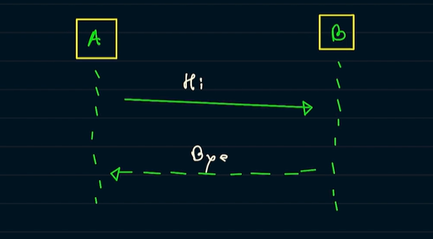

UML refers to Unified modelling language and its a standard way for visual representation 
of system or a feature in a system which we are building that how they it will behave interact etc.
It acts as a plan or blueprint for developers, architects, and stakeholders. It helps everyone understand, 
design, and communicate how a software system works.

UML has 3 aspects:

1) Things
2) Relationship
3) Diagram

######Things:

Things in UML is composed of

1) Structural
2) Behavioral
3) Grouping

Structural in things inside UML is composed of following; 

a) Classes: 

Classes are simple classes which are used for encapsulation of states/instance variables and behavior/methods.
Classes are represented as 

b) Objects:

Objects of classes in UML are represented as 

c) Interface:

Interfaces are represented as 

d) Use case:

As name suggest use case refers to the use case which the system provides to the user or which the system
is currently dealing with in context to current design 

e) Actor:

Actor refers to the user or the person who will interact with the system. 

f) Component:

As name suggest component refers to the section or part of the system which we are dealing with and is
represented as 

g) Node:

Node refers to the physical aspect of the system such as server as is represented as 

Behavioral in things inside UML refers to the system interactions is composed of following:

a) Activity diagram:

It refers to the interaction on the component and An Activity Diagram represents the workflow or process flow of a 
system . It is represented by 

b)Interaction diagram:

It refers to the interactions between the two components or An Interaction Diagram represents 
the interactions between objects over time. It focuses on how objects communicate to accomplish a task.

