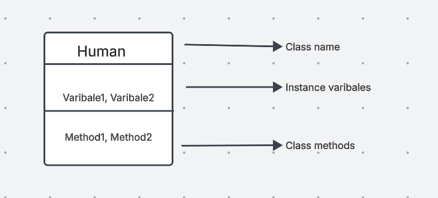
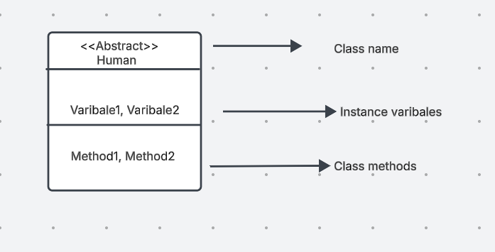
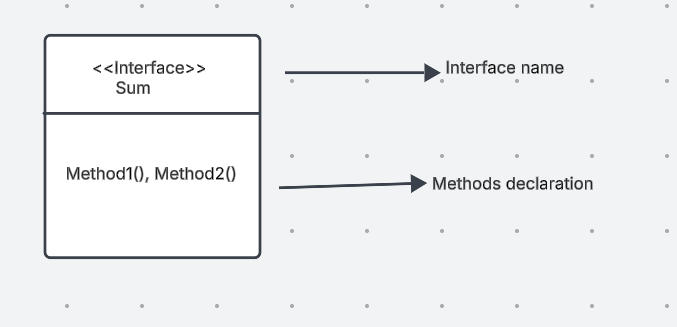
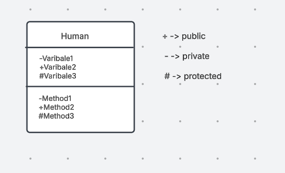
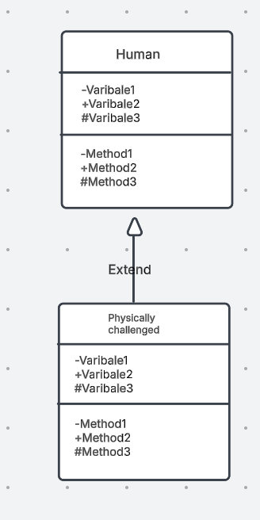
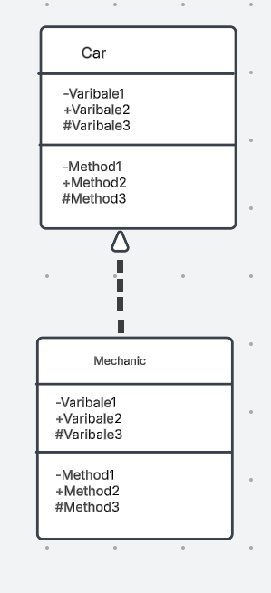
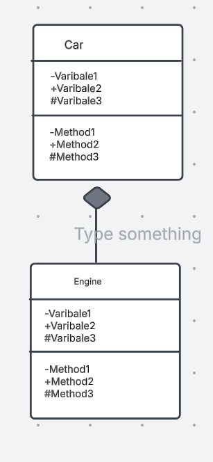
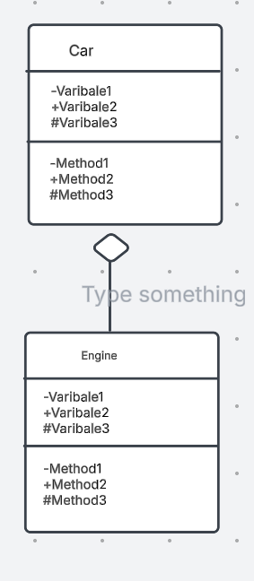

**Class diagram**

Class diagram is most widely used depiction of the system in terms of diagram which can be understood by
the stake holder as well.

It has different types of notation like:

a) Class
b) interface, abstract class, enums
c) access modifiers.
d) Relationships

**Class:**

A class in class diagram is represented as 

**Abstract class:**

Abstract class is used to achieve data hiding and in class diagram is represented as 

**Interface:**

Interface is also another way of achieving data hiding and in class diagram it is represented as 

**Access modifiers:**

All the access modifiers like public, private and protected in class diagram can be represented as 

**Relationship**

a) Simple association: 

It basically refers to one class having an association to another class or simply
one class is inheriting from another class i,e inheritance and in class diagram it can be represented as 

b) Dependency:

The difference between dependency and simple association is that dependency is temporary for ex: say a car class
needs a mechanic so car class would have a dependency of mechanic only when we need to fix the car so, in class
class inside the fixCar method we need mechanic object so mechanic object is passed as reference only to this method
within the car class but not to whole car class itself else it would have been aggregation.
So such type of temp dependency in class diagram can be represented as 

c) Composition or part-of relationship:

A composition or part of relationship is one in which one objects life cycle is dependant over the
other in such a way that if one seize to not exist other also wont exist. For ex: when one class creates
an instance of another class within itself. In class diagram it is represented as
(dark diamond) 

d) Aggregation:

A aggregation is a has-a relationship and in this one object life cycle is not dependent over other
in such a way that if one does not seize to exist that other also wont exist. For ex: one instance of one
class is passed as reference to the other class. In class diagram it can be represented as
(hollow diamond) 

