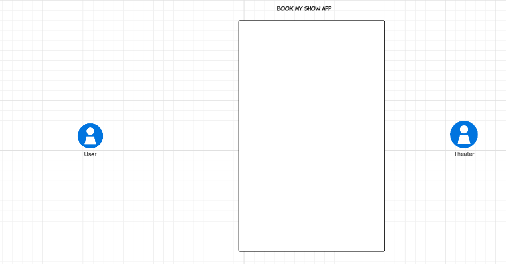
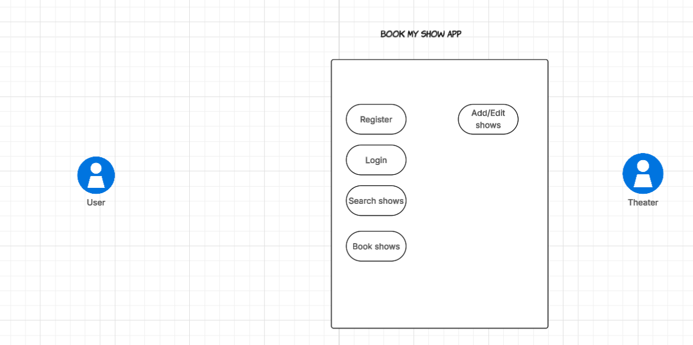
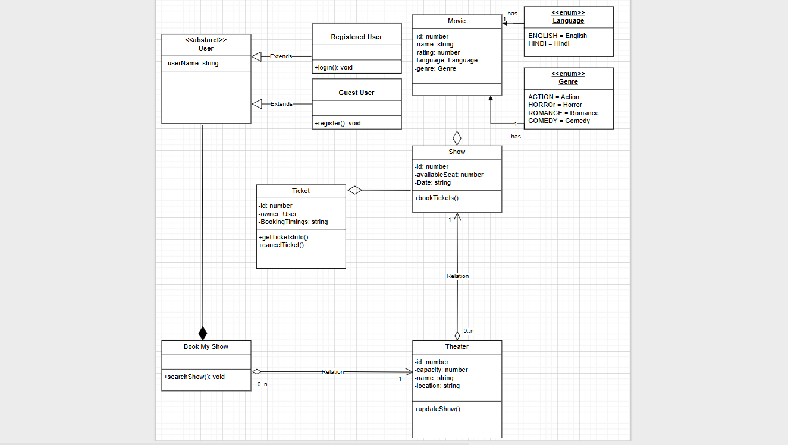

**The problem statement is to create a app i,e book my show.**

Now for designing of any system these 5 steps should be followed.

a) Gather all requirements
b) Create use case diagram (System high level understanding)
c) Create class diagrams (Low level/ depth understanding of the system)
d) Create skeleton code
e) Complete code implementation.


a) **Gather all requirements**

Now lets start with gathering all the requirements. 

These below requirements are basic and this we can think of:

1) User should be able to register/login.
2) App will be listing all current movies and their respective shows.
3) User should be able to search for shows corresponding to a movie in our app.
4) User should be able to book movie tickets- for shows in our app.
5) Theater should be able to edit/add shows for movies.
6) App should store history of bookings of shows for a user
7) User should be able to cancel his booked tickets.

For complex or add on functionalities we can ask the interviewer some requirement gathering questions like

6) Do theaters have multi screen, i,e one theater can show multiple different movies
7) The user will be able to select seats based upon its availability
8) Multi language movies
9) Payment methods


Now we have done requirement gathering, the main goal of our after this should be to create a MVP i,e most viable prototype 
a MVP is a preliminary model which supports basic functionality and is open to extension, after creation of an MVP
then we can extend it to add more functionalities. The mvp should be designed like this that it should support extension.

Now in order to create a MVP we may have to support some assumption in initial phases.
Then list down these assumptions:

1) Every theater is single screen
2) Currently we support two language type movies i,e english and hindi
3) Every theater has a capacity, no of seats
4) Registered user can book tickets whereas un registered user can just search for movies
5) There are 4 genre of movies available in our system as of now horror, comedy, thriller, romance 
6) We are not considering payment module as of now


b) **Create use case diagram (System high level understanding)**

Now based on the requirements which we have gathered up to now we will create a use case diagram for high level
understanding of the system.

There there are certain steps that should be considered while creation of use case diagram
a) Identify actors
b) Identify use cases
c) Add association of actor and use cases
d) Identify inclusive use case
e) Add extension use case
f) Add inheritance


1) **Identify actors:**
   
Upon analysis of above requirements we found out that there are 2 actors for our system i,e the users and the theater
as users can book and theaters can edit or add movies.

Actors:
       Theater
       User

Both of these actors are primary actors as they interact with the system directly and not as third party.
So our use case diagram till now looks like: 

2) **Identify use cases:**

Now lets identify the use cases

1. Login
2. Register
3. Search shows/movies
4. Book shows/movies

5. Add/edit shows/movies 

These are all the use cases that can be identified and thus the use case diagram now looks like: 


3) **Add association between actors and use cases**

Now login, register, search shows/movies and book shows/movies are associated with user and add/edit show/movies
are associated with theater so we make the association accordingly and the use case diagram looks like


4) **Identify inclusive use case**

Inclusive use case means use case which are inter related to each other for example in our case
when we book shows/movies the user should be also able to select the movie he want to book so
booking a movie use case is inclusive with selection of movie and thus the use case diagram looks like


5) **Add extension use case**

We can have multiple extension use cases in our application later on 
like multiple language support, payment methods etc and thus we will simply
be skipping it for now.


6) **Add inheritance**

Now we should identify high level inheritance in our application.

So a user can be a registered user and a unregistered user.

So both of these types of users are users thus they can inherit from user.
The use cases association will also change now respective to the user for ex:

Login will be for registered user
Register for unregistered user
Search shows/movies for users both registered and unregistered
Book shows/movies for registered users

Now our use case diagram looks like:


c) **Create class diagrams (Low level/ depth understanding of the system)**

Now based upon the above understanding lets try to formulate the classes and what relationship they will have
amongst each other.

The class diagram will look like: 

So first we have book my show class which is the main app, book my show can be associated with multiple
theaters and we provide a method to search for their show to users either registered or unregistered.

A user can be of two type i,e registered or unregistered. We have created user class as abstract class 
it has instance variables like userName.

A registered user can login in our app whereas a guest or unregistered user can register in our app.

A theater has a id, name, location and a capacity. It can host many shows. A theater can updateShows i,e
it can update shows information.

A show can be of a movie currently and later on can be extended further to be a show of live comedy or say
live music concert etc, at this point of time , we are considering for a movie.

A show can have a single movie, apart from that a show will always be hosted in a theater, has available seats
for it and a timing for it.

A movie will have a name, a genre, a language and a rating.

A ticket can be booked for a show and thus show can have a bookTicket method as well.

A ticket class will have a id, booking timings, show for which its being booked for, the user who booked it.
we can get the ticket info and can cancel a ticket.

This all highlights the concrete functionality now lets understand how it will work.

A user say registered enters the system 

let gaurav: RegisteredUser = new RegisteredUser("Gaurav");

Now we have two theaters i,e pvr and IMAX

let pvr: Theater = new Theater("pvr", "Delhi", 600);
let IMAX = new Theater('IMAX', "Delhi", 500);

There are three movies which are at current trending i,e

let kgf: Movie = new Movie("Kgf", Genre.ACTION, Languages.HINDI);
let interstellar = new Movie("Interstellar", Genre.ACTION, Languages.ENGLISH);
let pushpa = new Movie("pushpa", Genre.ACTION, Languages.HINDI);

Both the theaters has shows for these movies

//Pvr shows
let kgfShow_PVR: Show = new Show(new Date("4/8/2025"), kgf, pvr)
let interstellarShow_PVR: Show = new Show(new Date("4/8/2025"), interstellar, pvr)
let pushpaShow_PVR: Show = new Show(new Date("4/8/2025"), pushpa, pvr)

pvr.shows = [kgfShow_PVR, interstellarShow_PVR, pushpaShow_PVR];

//IMAX shows
let kgfShow_IMAX: Show = new Show(new Date("4/9/2025"), kgf, IMAX)
let interstellarShow_IMAX: Show = new Show(new Date("4/9/2025"), interstellar, IMAX)
let pushpaShow_IMAX: Show = new Show(new Date("4/9/2025"), pushpa, IMAX)

IMAX.shows = [kgfShow_IMAX, interstellarShow_IMAX, pushpaShow_IMAX];

Now bookMyShow is associated with both of these theaters

let bms = new BookMyShow([pvr, IMAX]);

Now the user ir respective of registered or unregistered , searched for 

console.log(bms.searchShows("pushpa"));

So how it works internally searchShows.


In order to do this we have created a movieMap in the book my show itself. Which is a map of 
string -> Shows[], string is our movie name and movie can have multiple shows in different theaters.

Now as soon as the object of book my show gets created we will call a method which will fill this map.

i,e constructor(theater: Theater[]) {
        this.theater = theater;
        this.movieMap = new Map();
        this.generateMovieMap();
    }

```typescript
public generateMovieMap() {
        for (const theater of this.theater) {
            for (const show of theater.shows) {
                if (!this.movieMap.has(show.movie.name)) {
                    let shows = [show];
                    this.movieMap.set(show.movie.name, shows);
                } else {
                    let currentShowList: Show[] | undefined = this.movieMap.get(show.movie.name);
                    currentShowList?.push(show)
                    if (currentShowList) {
                        this.movieMap.set(show.movie.name, currentShowList);
                    }
                }
            }
        }
    }
```

Lets understand generate movie Map.

So book my show has multiple theaters associated with it, thus we iterate over all the theaters.
Now a theater can have many shows and each show will have a movie.

If the map does not contain that movie name this means we need to add a list of show for it.
So we add the show to an array and mark it as value for that movie name key and push to map.

In case the map already contains the movie name thus we will take out the value i,e shows[]
and will add that show to the showList.

In this way our movie map will get formulated.

Now when user wants to search we will call search shows in book my app and will try to find that
movie name in the movie map. If that movie name is not present in movie than it means that there are no 
available shows for that movie.
Else we will return the list of shows which are available for that movie.

```typescript
public searchShows(movieName: string) {
        if (!this.movieMap.get(movieName)) {
            console.log(`No shows available for the ${movieName}`);
        } else {
            return this.movieMap.get(movieName);
        }
    }
```

Now he got the list of the shows which we wanted for his movie name and thus now we wants
to book a ticket.

Now bookTickets is for shows so we can a helper function in bookMyShow app only which will
call the bookTicket of show class.

```typescript
public bookTickets(show: Show, numberOfTickets: number, user: User, theater: Theater) {
        return show.bookTickets(numberOfTickets, user, theater, show);
}
```

Lets say the user wants to bookShow for kgf in pvr
thus

let kgf_pvrTicket = bms.bookTickets(kgfShow_PVR, 20, gaurav, pvr);
inside the bookTickets methods in show class we have placed the logic

```typescript
public bookTickets(numberOfSeats: number, user: User, theater: Theater, bookedShow: Show): Ticket | null {
        if (!(user instanceof RegisteredUser)) {
            console.log("please register for before proceeding to book tickets")
            return null;
        } else if (this._availableSeats < numberOfSeats) {
            console.log(`${numberOfSeats} not available for the ${bookedShow}`)
            return null;
        } else {
            let ticket = new Ticket(numberOfSeats, user.userName, bookedShow, new Date(), theater);
            this._availableSeats -= numberOfSeats;
            console.log("ticket booked successfully");
            return ticket;
        }
    }
```

if the user is not a registered user than he shall not be allowed to book tickets.
If in case the _availableSeats for the show is lesser than the number of tickets which the user
is willing to book than also he wont be able to book.

Else , he will be able to book his tickets and we create a new instance of ticket and provide
numberOfSeats, user.userName, bookedShow , bookingTimings and the theater for which this show has been
booked for. Moreover if a ticket is booked this means the available seats for the show has now
reduced by the number of seats which got booked.


Now if the user searches for kgf show

console.log(bms.searchShows("Kgf")); then he will get lesser available seats in pvr theater show for it.

A user can also see his booking details

kgf_pvrTicket?.getBookingDetails();

Moreover a user can also cancel his ticket

kgf_pvrTicket?.cancelTicket();

Once he cancels the tickets the available seats which are in show should now gets updated back in ticket class
as

```typescript
public cancelTicket() {
        if (this.bookedShow && this.bookedShow.availableSeats) {
            this.bookedShow.availableSeats += this.numberOfSeats;
        }
        console.log("Ticket cancelled successfully")
    }
```

This was all regarding the book my show app.

