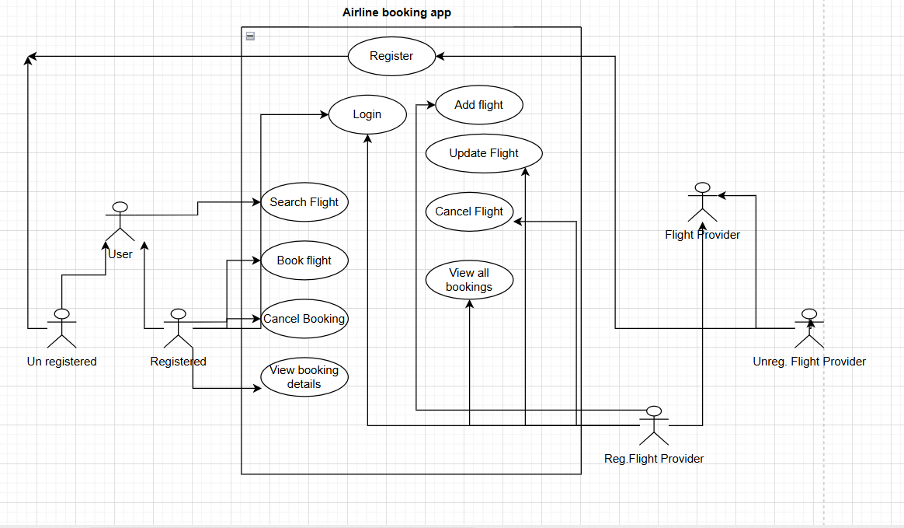

The problem is to create a airline booking system, for example when we search for flights in paytm or say amazon flights
or say skyskanner.

A system design consist of 5 major steps which have been given in detail while solving Book my show design problem.

a) Gather all requirements
b) Create use case diagram (System high level understanding)
c) Create class diagrams (Low level/ depth understanding of the system)
d) Create skeleton code
e) Complete code implementation.

**Gather all requirements:**

1) There can be two type of user in our app
     1.1 User
          - Registered
          - Unregistered
  
     1.2 Flight Providers
          - Registered
          - Unregistered

2) Registered User:
          - Login
          - Search flight
          - Book flight
          - Cancel Booking of flight
          - View booking details

3) Unregistered user:
          - Register
          - Search flight

4) Registered Flight Provider
          - Login
          - Add a flight
          - Update a flight
          - Search for a flight
          - View all bookings for a flight
  
5) UnRegistered Flight Provider
          - Register

**Use case diagram**

Basic use case diagram looks like: 

Based upon the requirement gathering, we have come up with the above use case diagram.

**Class diagram**

After understand this scenario we will be proceeding with the class diagram.

FinalNotes\LLD\PractiseProblems\02_AirlineBookingSystem\AirLineBooking.drawio.html