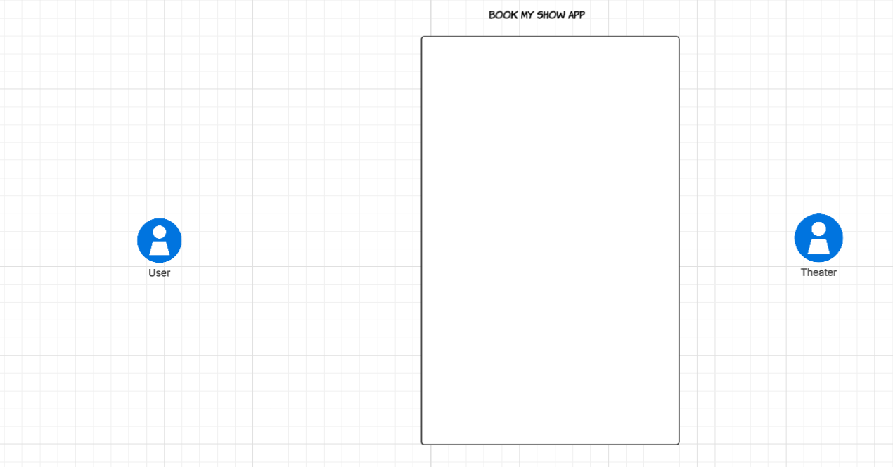
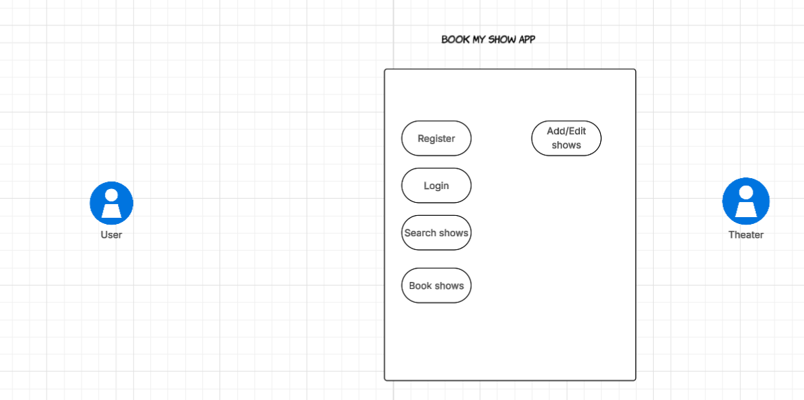

**The problem statement is to create a app i,e book my show.**

Now for designing of any system these 5 steps should be followed.

a) Gather all requirements
b) Create use case diagram (System high level understanding)
c) Create class diagrams (Low level/ depth understanding of the system)
d) Create skeleton code
e) Complete code implementation.

a) **Gather all requirements**

Now lets start with gathering all the requirements. 

These below requirements are basic and this we can think of:

1) User should be able to register/login.
2) App will be listing all current movies and shows.
2) User should be able to search for movies in our app.
3) User should be able to book movie tickets in our app.
4) Theater should be able to edit/add shows and movies.
5) App should store history of booking for a user
6) User should be able to cancel his booked tickets.

For complex or add on functionalities we can ask the interviewer some requirement gathering questions like

6) Do theaters have multi screen, i,e one theater can show multiple different movies
7) The user will be able to select seats based upon its availability
8) Multi language movies
9) Payment methods

Now we have done requirement gathering, the main goal of our after this should be to create a MVP i,e most viable prototype 
a MVP is a preliminary model which supports basic functionality and is open to extension, after creation of an MVP
then we can extend it to add more functionalities. The mvp should be designed like this that it should support extension.

Now in order to create a MVP we may have to support some assumption in initial phases.
Then list down these assumptions:

1) Every theater is single screen
2) Currently we support two language type movies i,e english and hindi
3) Every theater has a capacity, no of seats
4) Registered user can book tickets whereas un registered user can just search for movies
5) There are 4 genre of movies available in our system as of now horror, comedy, thriller, romance 
6) We are not considering payment module as of now

b) **Create use case diagram (System high level understanding)**

Now based on the requirements which we have gathered up to now we will create a use case diagram for high level
understanding of the system.

There there are certain steps that should be considered while creation of use case diagram
a) Identify actors
b) Identify use cases
c) Add association of actor and use cases
d) Identify inclusive use case
e) Add extension use case
f) Add inheritance

1) **Identify actors:**
   
Upon analysis of above requirements we found out that there are 2 actors for our system i,e the users and the theater
as users can book and theaters can edit or add movies.

Actors:
       Theater
       User

Both of these actors are primary actors as they interact with the system directly and not as third party.
So our use case diagram till now looks like: 

2) **Identify use cases:**

Now lets identify the use cases

1. Login
2. Register
3. Search shows/movies
4. Book shows/movies

5. Add/edit shows/movies 

These are all the use cases that can be identified and thus the use case diagram now looks like: 

3) **Add association between actors and use cases**

Now login, register, search shows/movies and book shows/movies are associated with user and add/edit show/movies
are associated with theater so we make the association accordingly and the use case diagram looks like

4) **Identify inclusive use case**

Inclusive use case means use case which are inter related to each other for example in our case
when we book shows/movies the user should be also able to select the movie he want to book so
booking a movie use case is inclusive with selection of movie and thus the use case diagram looks like

5) **Add extension use case**

We can have multiple extension use cases in our application later on 
like multiple language support, payment methods etc and thus we will simply
be skipping it for now.

6) **Add inheritance**

Now we should identify high level inheritance in our application.

So a user can be a registered user and a unregistered user.

So both of these types of users are users thus they can inherit from user.
The use cases association will also change now respective to the user for ex:

Login will be for registered user
Register for unregistered user
Search shows/movies for users both registered and unregistered
Book shows/movies for registered users

Now our use case diagram looks like:

c) **Create class diagrams (Low level/ depth understanding of the system)**

Now based upon the above understanding lets try to formulate the classes and what relationship they will have
amongst each other.

First our app book my show which will be having a composition relationship with user class which will be an
abstract class as there can be two users i,e guest or registered which will extend this class.