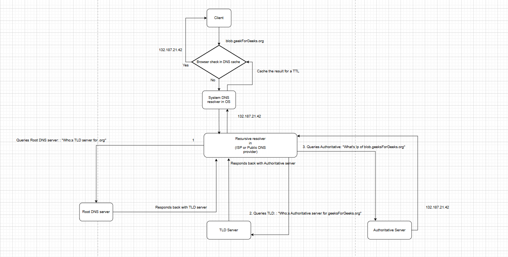

**DNS Resolver**

Now lets understand domain name server (DNS) which is a server.

So previously our client was sending a request to a server and a server was sending back the response.
Lets suppose the client wants to interact with a server.

So the client say hits the server like

http://geeksForGeeks.org

Now the server is hosted and is uniquely identified by an IP so say the server is running on an IP
142.136.92.42 

So ideally in order for the client to communicate with the server it has to hit something like

http://142.136.92.42

So the request which client sends like http://geeksForGeeks.org is user friendly whereas the 
http://142.136.92.42:20 is device friendly as devices communicate over IP.

So its the responsibility of the DNS or domain name server which holds a mapping of domain names with corresponding
IP address corresponding to that domain.

So once a client make a request say via http://geeksForGeeks.org with domain name geeksForGeeks.org it 
reverts back with the resolved IP of that domain and thus the client will be able to communicate with the server.

               http://geeksForGeeks.org
Client    --------------------------------------------->DNS
          <---------------------------------------------
[mobile,         http://142.136.92.42:20 
web,                                   
desktop,                               
Tv,'       -----------------------------------------------------------Server                                 
watch]                     http://142.136.92.42:20

Lets understand the architecture of DNS server. DNS acts as a phone book for internet.
Suppose we have a library and library has a lot of books now all these records are managed via a register which
has the book name and the corresponding shelf number where the book is placed.

This type of system seems simple but its difficult to maintain and has high latency.

Problems with having such system:

a) When a user is finding the book through register, the resource i,e register is locked
and no other user can find his book till be release the register.

b) The book will be huge as there can be n number of books in the library thus searching and going through each
entry in register is not effective and costly operation.

c) Adding a new entry or updating an existing entry or deleting an entry is also time consuming .

Thus such system is not feasible or viable so in case we are thinking to design the DNS server in the same manner
than its a bad idea.

How ever if we can think of something where one level has info that books from say alphabet A-E are present 
in Shelf 1, E->I are in shelf 2.

Now shelves contains info that AA->AE are present in row 1 similarly so on, such type of arrangement will be more effective.

Now lets understand the architecture of DNS. 

A domain name say blob.geeksForGeeks.org can be subdivide into three components if seen from right to left

org can be considered in TLD i,e top level domain
geeksForGeeks can be considered as actual domain
blogs are subdomain

so say we have www.google.com

com -> TLD (top level domain)
google -> actual domain
www -> subDomain

So its basically a tree structure where (.) is considered as root, 

                                      .

                    |                  |                  |
                    org               com               net                  --------> TLD(top level domain)
            |         |             |     |            |
            gfg      wiki        google   amazon    php                       -------------> Actual domain
        |                         |
        blob                     www                                         -------------> Sub domain

Now lets understand the flow how DNS architecture works:

                                                ----------------------------->
                                Client                                              Server
                                                <-----------------------------
                                    ||
                                    ||
                                    ||
                                    ||                                           
                                    ||
                                    ||                                      
blob.geeksForGeeks.org              Resolver                                    
                                    ||
                                    ||
                                    ||
                                    ||
                                    ||
                                    ||
                                    ||
                                    
                                DNS                  ------------------------->        Root server
                                                     <-------------------------

                                                     ------------------------->         TLD server
                                                     <-------------------------

                                                                                    
                                                    ------------------------->        Authoritative server   
                                                    <-------------------------

So suppose a client wants to access the domain blob.geeksForGeeks.org. The process works as follows:

Client's browser first checks its local DNS cache to see if it already has the IP address for the domain.

If the entry is not cached, the browser forwards the request to the system's DNS resolver (usually the one configured by the OS,
which contacts a recursive resolver).

The recursive resolver (often provided by your ISP or a public DNS provider) acts as a middleman between the client and the 
DNS infrastructure. It is responsible for resolving the domain name into an IP address by contacting various DNS servers.

The resolver starts the DNS resolution process by querying a root DNS server:

It asks: “Who is the TLD server for .org?”

The root server responds with a referral to the TLD name server responsible for .org.

The resolver then queries the TLD server for .org, asking:

“Where can I find the authoritative DNS server for geeksForGeeks.org?”

The TLD server replies with the address of the authoritative name server for the domain.

The resolver then queries the authoritative DNS server:

“What is the IP address for blob.geeksForGeeks.org?”

The authoritative server responds with the actual IP address of the subdomain.

The resolver caches the result (for the duration of the TTL (time to live)) and returns the IP address to the client.

Finally, the client uses the IP address to establish a connection to the server hosting blob.geeksForGeeks.org.

See diagram : 

Client ------> 

So if we try n understand this with the hierarchial tree that we saw above

                                      .                                       -> Root server

                    |                  |                  |
                    org               com               net                  --------> TLD(server)
            |         |             |     |            |
            gfg      wiki        google   amazon    php                       -------------> Authoritative server
        |                         |
        blob                     www                                         

The resolver ask the root i,e the root server that where is org- i,e the Root server sends back reference of TLD server of org.

Now Resolver ask the TLD server that where is gfg.org so it sends back an Authoritative server

Now resolver ask the Authoritative server where is blob.gfg.org so it sends back an IP to resolver, we can say that
leaf contains the IP and its just like searching for a path in tree where the leaf node at end of the path will
give an IP to resolver.

This IP is being cached and send back to client which uses it to communicate with server.

DNS server also has load balancing suppose one domain name maps to multiple ip's i,e the system have multiple servers
through which it can operate and thus DNS servers provide load balancing to distribute traffic to these different servers.

