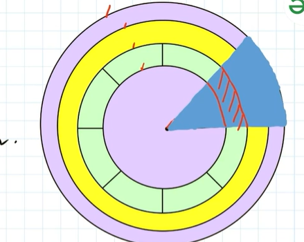

**Database indexing**

Suppose we have a database or a node , now this node must be hosted on a machine. This machine will have a RAM and a disc
say an HDD or SSD. Now where data is stored in a database or a node is a disc. Whenever a query like read or retrieval comes in,
we are interacting with the disc in case of a cache miss because some data may be present in cache i,e RAM, so in case of cache miss
we need to interact with disc which is time consuming and costly, so why not to have a kind of data structure
in place on disc which will help us query fast from the disc itself.

How it works, if there is nothing which can save us some time during disc interaction in say searching of data in disc, then this thing needs to be searched throughout the disc and disc can be very large and thus we need a mechanism which will help in read queries.

So databases maintain some kind of data structure also called indexes in disc and some data of these disc in memory i,e RAM which help in finding exact location where the data that we need is exactly stored in disk, with the help of these indexes the read operation becomes fast for databases.

Lets consider example of such an indexes used by database say a hash table.

Now instead of diving inside the disc , the query goes to hash table first.

Say the exact data table to viewer looks like

UserID	       Name	            Email
1	           Alice	        alice@example.com
2	           Bob	            bob@example.com
3	           Charlie	        charlie@example.com

now consider that database created a hash indexes on email column 

So the indexes of database look like

hash("alice@example.com")   → Page 5, Row 1
hash("bob@example.com")     → Page 9, Row 4
hash("charlie@example.com") → Page 2, Row 7

this hash is a hash function like SHA, now a read query comes in for finding user by email, so this user input email
will be hashed, and be found in hash table , the corresponding location of the row will be found and returned in 0(1) time
this seems simple but there exists a problem with database indexes like hash table, as it don't support range queries
like say give me all rows between say id 1->10 if the database has hashed index id for maintaining this hash table, as hash destroys
the order in which it stores so we can't find the correct in between records for a range.

Moreover there are always chances of collisions.

So better database indexes/data structures has to be used like B Tree, B+ trees, Quad trees etc.

**Advantages of indexes**

a) The ideal indexes like B+tree store the helper data needed to find location in disc in sorted manner, so say if a query comes in,even to search through the Indexes of database we can simply use binary search which does the job in 0(logn)

b) Sort queries become very fast

c) Uniqueness in records can be managed via indexes only

**Disadvantages**

a) Whenever we want to write data, it has to be written both in disc as well as our indexes so write generally becomes 5% slower
in case our database use indexes.

In general if our use case is more read than write i,e the read/write ratio is very very large say 1000, i,e 1000 searches
for 1 read then indexes are helpful, however in a write dominant application indexes can be avoided.

**In depth of disc structure**

Every disc (magnetic discs) have tracks which are concentric circles on disc
            
Consider this diagram 
as full circular disc so there are many tracks like outer purple circle , then inner yellow circle etc. These are all tracks

Now consider an arc on the disc like the blue arc, this is known as a sector.

The area of intersection between an sector and a track is called as a block (high lighted red section).

Now data is stored inside these blocks.

Lets consider an example that every block can store 512Bytes of data.

Say we have a user table and it has 100 records where every row takes 128bytes.

Now inside one block on the disc we can store (512/128) = 4 records only.

So in order to store the entire 100 records i,e (128*100 bytes) we need (12800/512) = 25 blocks.

Say now a read query comes in, which says give me student details with id = 1.

So entire 25 blocks has to be searched to get this data.

Say, instead of directly searching the disc we placed an indexes/data structure on disc which helps us with
info regarding data, say we created an hash table.

This hash table stores id of student record -> block id where record is present.

Now say id of student records is 8 byte and block id where record is placed is 4 bytes. So every entry in hash table is
12 bytes.

We have 100 records in total this means total entry on hash table will need (12 * 100) = 1200 bytes
Now every block can store 512 bytes , this means in order to store this 1200 bytes we need (1200/512) ~= 2.34 ~= 3 blocks

Now 3 blocks we need to store this hash and 1 block we need to go and get data from once a read query comes in
this means previously without indexes we have to go through 25 blocks to get the data,
now only 4 blocks to get the data.

This is significantly efficient but now consider a real scenario in which we have millions of records
now even this will not be so much fast, thus we need to use better indexes in this case than hash table.

If we can have multi-level indexes which also stores data in some sorted manner than it can drastically reduce the query
time.

From above we can see that total entry on hash table will need (12 * 100) = 1200 bytes
Every block can have 512bytes so we needed approx 3 block to save all this data.

Now this also means that every block can save around 400 records.

Lets understand this, say if our indexes was something like
                          
                          1 | 400 |  800 | 1200

            |1,2,3,4,5,..400|  |401,402.......| |............|

So if we need a record with id as 1, we saw in our indexes so 1 is lying between 1->400 so go left, we found block id corresponding
to id 1. 

So 2 blocks we needed for getting block id and 1 block for actual data on disc after getting block id.

This in case of huge number of records can save a lot of time, and this multi-level hierarchal data structure as indexes
are Btree/B+ tree which are the most common indexes in database.

