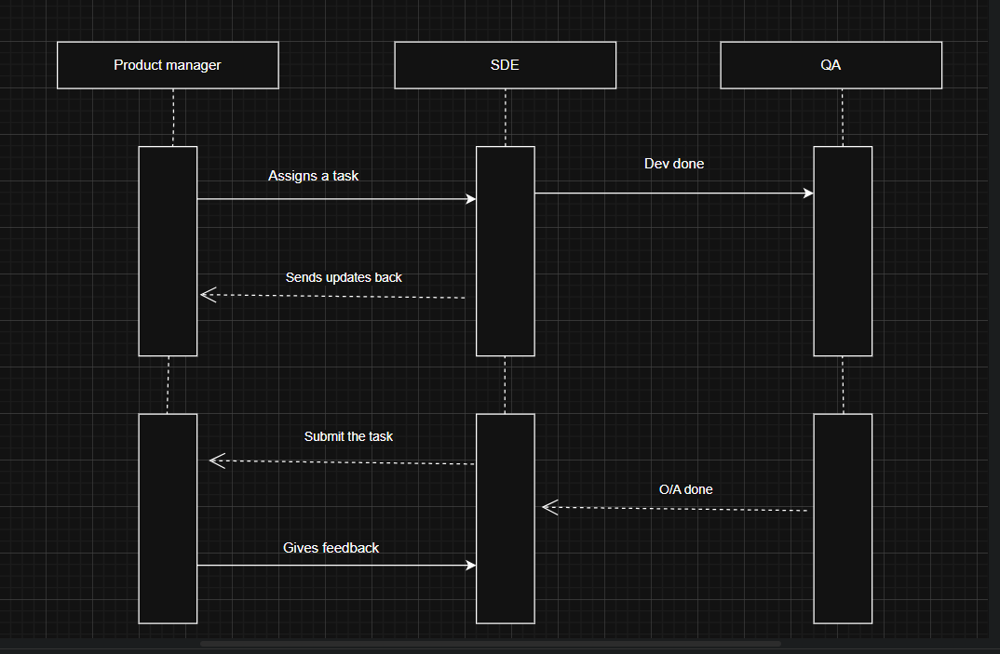

**Sequence diagram**

A sequence diagram represents the interactions between different roles/objects/classes in a sequential
manner.

Lets take an example of software development life cycle in which, first a product manager assigns task
to a developer, developer analyze and gather the requirements and revert back to Pm.

Since this task which is assigned to developer is synchronous i,e for developer he need to wait
for a task to be assigned to him to it is represented by a solid arrow.
Now this revert back of developer with updates is not synchronous or is asynchronous for PM as we don't
keep on waiting for updates from developer and halt his work , he will proceed with next work thus such
asynchronous calls are represented by dotted lines.

Now the developer once finishes off his task send update to qa as dev done so this interaction is synchronous
as tester need to wait for developer to finish before they can start testing, now once done the tester
can revert back to Developer as done which is again asynchronous as developer need not to wait for qa to finish
the task before taking up new task thus represented by dotted line.

Once qa reverts back the developer mark the task done or submit the task to PM which is again asynchronous as
PM need not to halt everything for this thing.

Now the PM sends back the feedback to dev which is synchronous as dev has to wait for the pm to send back
the feedbacks before starting to work on them.

Thus in diagram 

there are three roles Product manager, Developer and QA or we can say three objects.
The vertical rectangles represents the activation bar or represents active period of object.
The dotted vertical lines connected with activation bars are the life cycle or life span of these objects during the interaction.
All synchronous interactions are represented by solid arrow where the sender waits for the
receiver to respond back whereas all asynchronous interactions where the sender does not wait for the response back from the receiver are represented by dashed arrows. 
