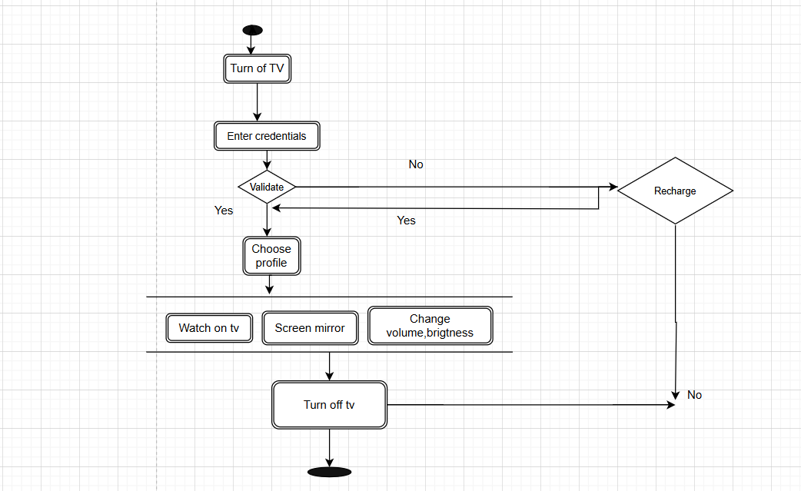

**Activity Diagram**

Activity diagram can be considered a flow chart which determines the sequence of a flow.
Lets take an example of a tv opening to closing i,e

A small colored oval represents the start of the activity or initial node, so first we open a tv which is an action and
thus all the actions are represented by round border rectangle.

After that we need to enter the credentials, now this is a condition that if credentials fails or credentials
succeed and thus any logical condition is represented by a diamond.

Now taking the case if the credentials fail and the tv is not recharged than there is a task to recharge the
tv and if he does not want to recharge then we come to task of closing the tv, however if he recharge we come
back to checking credentials.

Once credentials are successful, he has to choose his profile which is a action and thus in round border
rectangle. After that there are multiple task which can happen in parallel and are considered as fork represented
by upper line inside which all parallel running task can happen.

Join refers to joining multiple parallel running task to one task and is represented by the lower horizontal line
which is joining multiple task to one single task in the diagram.

After this, the user will turn off the Tv and this will mark as the end of the activity.